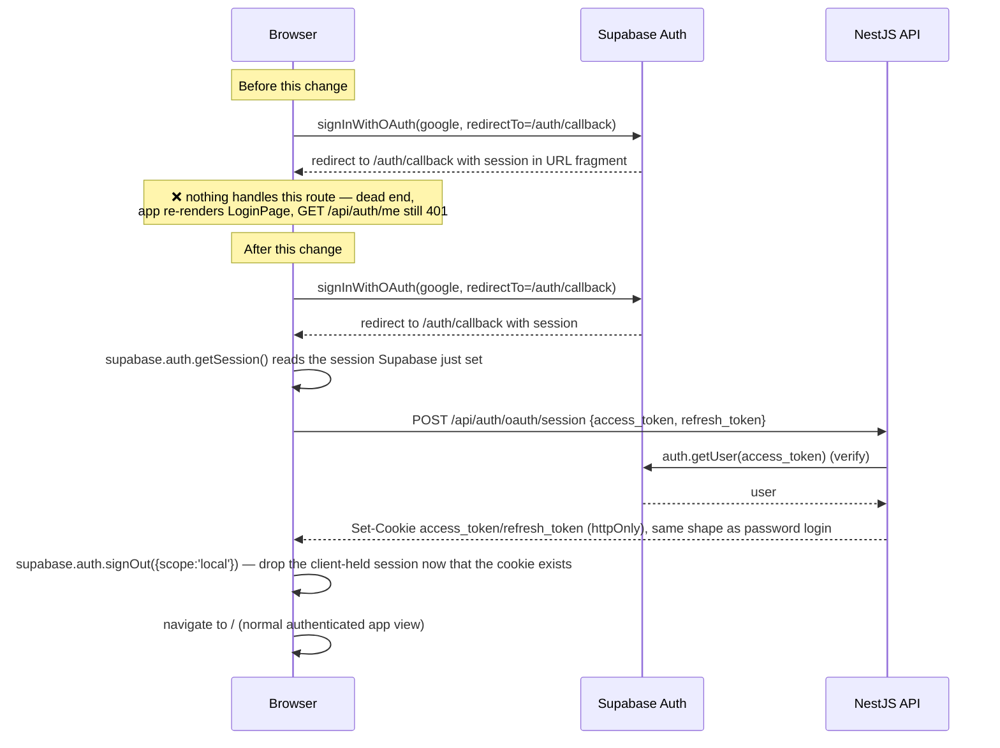

## Context

Atlas Lineage authenticates users two ways today:

- **Password login**: browser → `POST /api/auth/login` → `apps/api`'s `AuthService` calls Supabase (`signInWithPassword`) with the **service role key**, then the API mints httpOnly `access_token`/`refresh_token` cookies. The browser never sees a Supabase JWT directly; `SupabaseAuthGuard` re-verifies the cookie against Supabase on every request.
- **Google OAuth**: browser calls `supabase.auth.signInWithOAuth` directly (anon key, client-side), which redirects to Google, then back to `${origin}/auth/callback`. Nothing exists to catch that redirect. The browser's Supabase client is deliberately neutered (`persistSession: false`, `autoRefreshToken: false`) — it was wired up only far enough to *initiate* the redirect.

This means the OAuth path fundamentally requires the browser to hold a Supabase session (even if briefly), which the password path never has to do. The two flows can't be made identical without either (a) giving the browser a session only for the OAuth leg and then handing it off to the server's cookie model, or (b) moving everything to browser-held sessions.

## Decision

**Chosen: OAuth-only client session, handed off to the existing cookie model (narrow fix).**

The callback page is the *only* place the browser Supabase client is allowed to hold a real session (`persistSession` stays off for the ambient app-wide client; the callback reads the session Supabase already placed in the URL/local state after redirect, sends its tokens to the API once, and then the tab reloads into the normal cookie-driven app — no lingering client-side session).

### Options considered

| | **A. OAuth-only handoff (chosen)** | **B. Full client-owned sessions (shadcn `supabase-client-react-router` as-is)** |
|---|---|---|
| Scope | New callback route + one new API endpoint | Replaces `AuthContext`, `auth.service.ts` trust model, `SupabaseAuthGuard`, every protected endpoint's expectations |
| Session model | Still exactly one model: httpOnly cookie, server-verified | Two models during migration (cookie for password, browser JWT for OAuth) or a full rewrite to browser JWT for both |
| Router dependency | None — a callback can be handled with existing state-based routing (check `window.location.pathname` once on boot, same pattern the app already avoids elsewhere) or a minimal one-off path check | Requires adding React Router (the component is built for it); this app currently has none |
| Blast radius | Auth module + one web component | Every guarded endpoint's auth assumption, CORS/cookie config, XSS exposure surface (JWT becomes readable to any script on the page) | 
| Matches existing spec intent | Yes — `authentication` spec already commits to "httpOnly cookie" sessions for all requirements except the OAuth initiation | No — would require rewriting most of `authentication/spec.md`, not just adding to it |

Option B is a legitimate architecture (it's literally what Supabase's own scaffolding assumes), but it's a much larger, riskier change than "make the button people already see actually work," and it weakens the security model the rest of the app already committed to (server-verified httpOnly cookies vs. a JS-readable token). Option A is recommended and is what this change implements. If there's a future desire to move fully to client-owned sessions (e.g., to drop the API as a session broker entirely), that should be its own proposal — it touches `SupabaseAuthGuard` and every guarded controller, not just the login flow.

## Flow

## New API surface

`POST /api/auth/oauth/session`
- Body: `{ accessToken: string, refreshToken: string }` (from the client's just-completed Supabase OAuth session)
- Verifies `accessToken` via `supabase.auth.getUser(accessToken)` (same call `SupabaseAuthGuard` already makes)
- On success: same side effects as `AuthService.signIn` post-verification — `upsertProfile`, `claimDefaultTree`, set httpOnly cookies — returns `{ user: { id, email } }` in the same shape as `POST /api/auth/login`
- On failure: `401`, no cookies set

## Risks / open questions

- **Redirect URL allowlisting**: Supabase projects must have `${origin}/auth/callback` registered as an allowed redirect URL per environment (local dev, Vercel preview, prod). This is Supabase dashboard config, not code — call it out in `tasks.md` as a manual step.
- **Local dev without a real Supabase project**: `mock-supabase-server.js` (e2e) doesn't implement the OAuth redirect dance. The callback route should be reachable/testable without a real Google account for unit/component tests (test `getSession` resolving to a fake session and stub the new endpoint), leaving true end-to-end OAuth verification as a manual/prod check.
- **Race on first paint**: the callback route must finish the API handoff (and get a `200`) before treating the user as signed in, otherwise a fast redirect to `/` could show a flash of `LoginPage`. Keep the callback on its own loading state until the API call resolves, same pattern `AuthContext`'s `isLoading` already uses for the boot-time `me()` check.
